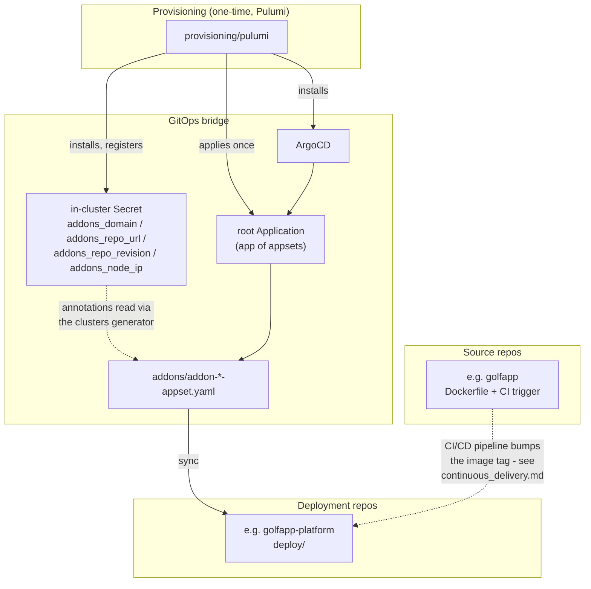

# Architecture

Four layers: a one-time Pulumi bootstrap, a GitOps bridge that lets every `ApplicationSet` stay
generic, deployment repos ArgoCD syncs, and source repos a CI pipeline builds from.

## Provisioning

`provisioning/pulumi` is the only piece that isn't GitOps — it can't be, something has to exist
before ArgoCD does. One `pulumi up` installs ArgoCD, registers the GitOps bridge Secret, and
applies `bootstrap/argocd/{projects,root-app,httproute}.yaml` directly (not through ArgoCD —
these are the files that make ArgoCD able to read the rest of the repo at all). See
[provisioning.md](provisioning.md).

## GitOps bridge

Every `addon-*-appset.yaml` is generic across environments because it never hardcodes
`repoURL`/`targetRevision`/domain — it reads them from the `in-cluster` cluster Secret's
annotations via ArgoCD's `clusters: {}` generator (`{{metadata.annotations.addons_domain}}` and
friends). Change `homelab:domain` or point the tree at a branch, and every appset picks it up
without being touched. See [the ADR](adr/use-gitops-bridge-for-repo-targeting.md).

The root `Application` ("app of appsets") scans `addons/*-appset.yaml` and applies whatever it
finds — platform addons (`applications/<name>/base`, same repo) and per-project appsets
(external deploy repos) are handled identically. See
[the app-of-appsets ADR](adr/use-app-of-appsets-gitops-pattern.md).

## Deployment repos

Own the `Rollout`/`Service`/`HTTPRoute` for a project — `Kustomize` bases, no application code.
Scaffolded from [homelab-deploy-template](https://github.com/atidyshirt/homelab-deploy-template).
ArgoCD syncs these directly; nothing here is built, only applied.

## Source repos

Own the Dockerfile and a thin CI trigger — no build logic (see
[continuous_delivery.md](continuous_delivery.md) for what happens after the trigger fires).
Scaffolded from [homelab-app-template](https://github.com/atidyshirt/homelab-app-template).
Deliberately a separate repo from its deployment repo, so the pipeline's own commits never
collide with app commits.

## Onboarding a project

[docs/workflows/adding_a_new_project.md](workflows/adding_a_new_project.md).
