# Continuous delivery

One shared pipeline, reused by every project: a push triggers a build, the built image gets
pushed to GHCR, and a commit back into the deploy repo hands off to ArgoCD + Argo Rollouts.

```mermaid
flowchart LR
    Push["git push<br/>(source repo)"] --> Runner["ARC runner<br/>(repo-scoped)"]
    Runner -->|"curl, no build logic"| Webhook["Argo Events<br/>EventSource (webhook)"]
    Webhook --> Bus["EventBus<br/>(JetStream)"]
    Bus --> Sensor["Sensor"]
    Sensor -->|submits| Workflow["Argo Workflow<br/>(build-and-deploy)"]

    subgraph Workflow steps
        Prepare["prepare<br/>clone + compute image name"] --> Build["build-and-push<br/>(kaniko -> GHCR)"]
        Build --> Bump["bump-deploy-repo<br/>kustomize edit set image<br/>+ git commit/push"]
    end

    Workflow --> Prepare
    Bump -->|commit| DeployRepo["deploy repo"]
    DeployRepo -->|sync| ArgoCD["ArgoCD"]
    ArgoCD --> Rollout["Argo Rollouts<br/>canary, paused"]
    Rollout -->|"kubectl argo rollouts promote"| Live["100%"]
```

## Trigger

A self-hosted ARC runner, registered against that one repo only (no account-wide option on a
personal GitHub account — see [the ADR](adr/scope-arc-runners-per-repo.md)). Its only job is a
`curl` to an internal, ClusterIP-only webhook — it never builds anything itself, so a compromised
or misbehaving runner can't do much (see [the ADR](adr/use-arc-as-trigger-bridge-only.md)).

## Argo Events

Webhook `EventSource` → `EventBus` (single-replica JetStream, matching the single-node cluster —
[the ADR](adr/run-single-replica-eventbus-jetstream.md)) → `Sensor`, which submits a `Workflow`
from the shared `build-and-deploy` `WorkflowTemplate`, passing through `repo`/`sha`/`deploy_repo`
plus `app`/`context`/`dockerfile`/`deploy_path` (for monorepos with more than one image — see
`applications/argo-events/base/pipeline/sensor.yaml`).

## Argo Workflows

`build-and-deploy` (`applications/argo-workflows/base/workflowtemplates/`), three steps sharing a
per-run PVC:

1. **prepare** — clone `{{repo}}@{{sha}}`, compute the destination image name, write kaniko's
   GHCR auth.
2. **build-and-push** — kaniko builds and pushes to `ghcr.io/<org>/<image>:<sha>` (GHCR, not
   Docker Hub — see [the ADR](adr/use-ghcr-for-container-registry.md)).
3. **bump-deploy-repo** — `kustomize edit set image` in the deploy repo's `deploy/` path, commit
   and push with a `gitops-bot` credential (see
   [the ADR](adr/commit-image-tags-back-to-git.md)).

## ArgoCD → Argo Rollouts

The deploy repo's `ApplicationSet` picks up the new commit and syncs normally. The `Rollout`
shifts a slice of traffic to the new version and **pauses** — no automated analysis step, a
human runs `kubectl argo rollouts promote` (see
[the ADR](adr/use-canary-with-manual-pause-for-rollouts.md)). The paused canary is reachable on
its own preview hostname (`<app>-canary.homelab.arpa`) before you promote it.

## Onboarding a project onto this pipeline

[docs/workflows/adding_a_new_project.md](workflows/adding_a_new_project.md).
